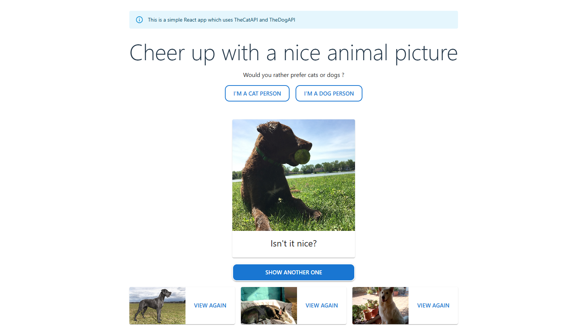

 

  
  

<h1>Hi there!  </h1>

I'm Liantsoa, a Software Engineer who recently moved to Germany after spending 5 amazing years in New Zealand. I'm a passionate developer who likes to continuously learn, experiment, and test new things. For me, coding is not just a challenge, it’s also rewarding, enjoyable, and always an opportunity to grow.

## Tech skills

#### Front End

Main skills

 Javascript
 Typescript
 HTML
 CSS

 React
 Redux
 Material UI
 Jest & React testing library

----

#### Back End

Main skills

Python
 Postgresql
 Postman

Also familiar with:

 NodeJS
 MongoDB

 Java
 Spring Framework

----

#### DevOps

Familiar with:

Docker  Amazon web services

#### IDEs/Editors

#### OS

#### Project management tools

  
  

---

#### Currently learning

 GraphQL
 AWS
 Spring Framework

---

### Highlighted projects

|  <a href="https://github.com/lrasata/cheer-up-app"><b>Cheer up app</b> </a>  | <a href="https://github.com/lrasata/themeal-recipe-db-app"><b>The Meal recipe DB</b> </a> | <a href="https://github.com/lrasata/question-workflow-frontend-app"><b>Question workflow App</b> </a> |
|:--------------------------------------------------------------------------------------------------------------------------------------------------------------:|:----------------------------------------------------------------------------------------------------------------------------------------------------------------------------------------:|:---------------------------------------------------------------------------------------------------------------------------------------------------------------------------------------------------------:|
| <a href="https://github.com/lrasata/todo-list-app"><b>My TODO List</b> </a> |         <a href="https://github.com/lrasata/lrasata-website"><b>Personal website</b> </a>         |                                                                                               Coming Soon!                                                                                                |
