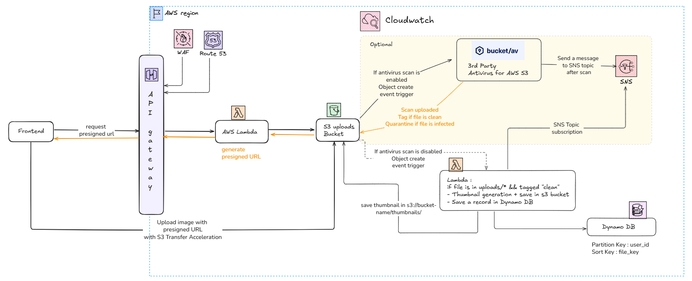
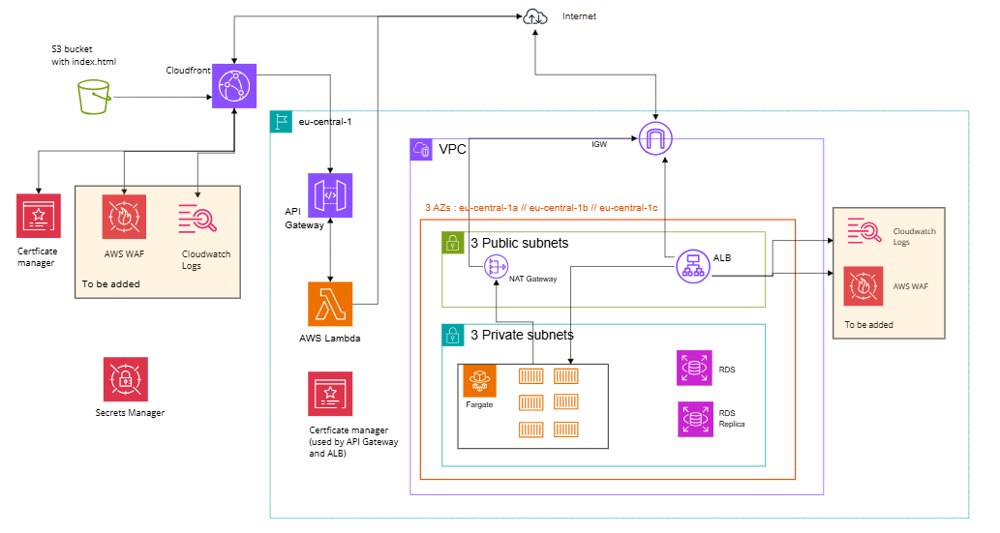
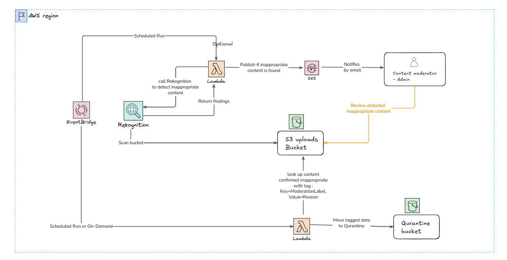
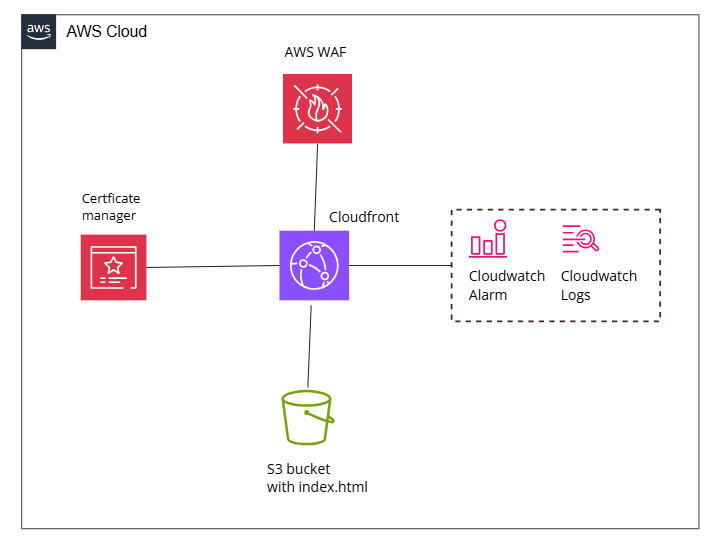

  <h1>Hi there! </h1>
  

    I'm <strong>Liantsoa</strong> — a Cloud Engineer (AWS Certified) with a full-stack background.
    Currently exploring, learning, and <strong>bringing ideas to life in the cloud</strong> ☁️
  

  

    
    
  

## Tech Stack

### ☁️ Cloud & DevOps

### ⚙️ Backend

### 🎨 Frontend

### 📚 Currently Learning

<h2>📌 Highlighted Projects</h2>
<table>
  <tr>
    <td align="center" width="240">
      <a href="https://github.com/lrasata/infra-image-uploader">
        <strong>File Uploader</strong> 
        
      </a>
    </td>
    <td>
      
Serverless file upload system with automated file validation, storage and antivirus scanning.

      

        ☁️ <strong>AWS:</strong> S3, API Gateway, Lambda, DynamoDB, Route53, WAF, CloudWatch, SNS 
        🧱 <strong>IaC:</strong> Terraform (module for reusable automation) 
        🔁 <strong>CI/CD:</strong> Yes (GitHub Actions) 
        🚀 <strong>Production-ready:</strong> Yes 
        🧠 <strong>Complexity:</strong> Medium–High
      

    </td>
  </tr>

  <tr>
    <td align="center" width="240">
      <a href="https://github.com/lrasata/infra-trip-planner-webapp">
        <strong>3-Tier Web App</strong> 
        
      </a>
    </td>
    <td>
      

        3-tier AWS infrastructure for a full-stack travel planner
        (React frontend, Spring Boot backend, PostgreSQL).
      

      

        ☁️ <strong>AWS:</strong> ECS Fargate, VPC, RDS, S3, CloudFront, Route53, API Gateway, Lambda, WAF, SNS 
        🧱 <strong>IaC:</strong> Terraform 
        🔁 <strong>CI/CD:</strong> Yes 
        🚀 <strong>Production-ready:</strong> Staging 
        🧠 <strong>Complexity:</strong> High
      

    </td>
  </tr>

  <tr>
    <td align="center" width="240">
      <a href="https://github.com/lrasata/infra-s3-image-moderator">
        <strong>Image Moderator</strong> 
        
      </a>
    </td>
    <td>
      

        Automated content safety scanner that periodically reviews S3 images using AWS Rekognition and flags or quarantines unsafe content.
      

      

        ☁️ <strong>AWS:</strong> S3, Lambda, Rekognition, EventBridge, SNS 
        🧱 <strong>IaC:</strong> Terraform (module for reusable automation) 
        🔁 <strong>CI/CD:</strong> In progress 
        🚀 <strong>Production-ready:</strong> Yes 
        🧠 <strong>Complexity:</strong> Medium (event-driven automation)
      

    </td>
  </tr>

  <tr>
    <td align="center" width="240">
      <a href="https://github.com/lrasata/infra-lrasata-website">
        <strong>Portfolio Website</strong> 
        
      </a>
    </td>
    <td>
      

        Personal portfolio infrastructure showcasing projects, deployed as a secure, globally available static website on AWS.
      

      

        ☁️ <strong>AWS:</strong> S3, CloudFront, Route53 
        🧱 <strong>IaC:</strong> Terraform 
        🔁 <strong>CI/CD:</strong> No 
        🚀 <strong>Production-ready:</strong> Demo 
        🧠 <strong>Complexity:</strong> Low–Medium (DNS, CDN, static hosting)
      

    </td>
  </tr>
</table>

<h2>📝 Latest Blog Posts</h3>

<ul>
  <li>
    <a href="https://medium.com/@rmliantsoa/building-a-production-ready-file-uploader-a-practical-approach-71825b21d497">Building a Production-Ready File Uploader: A Practical Approach</a> — Dec 16, 2025 • 4 min read
  </li>
  <li>
    <a href="https://medium.com/@rmliantsoa/how-i-split-my-terraform-infrastructure-into-independent-layers-9cfa014a7fce">How I Split My Terraform Infrastructure into Independent Layers</a> — Oct 26, 2025 • 4 min read
  </li>
  <li>
    <a href="https://medium.com/aws-tip/connect-your-ecs-tasks-to-s3-or-dynamodb-using-a-gateway-vpc-endpoint-its-free-and-more-secure-e47d7fc7f6b7">Connect your ECS Tasks to S3 or DynamoDB using a Gateway VPC Endpoint — it’s Free and more Secure</a> — Oct 21, 2025 • 4 min read
  </li>
  <li>
    <a href="https://medium.com/@rmliantsoa/detect-inappropriate-images-in-s3-with-aws-rekognition-terraform-b1ddd185c1db">Detect inappropriate images in S3 with AWS Rekognition + Terraform</a> — Oct 18, 2025 • 5 min read
  </li>
</ul>

