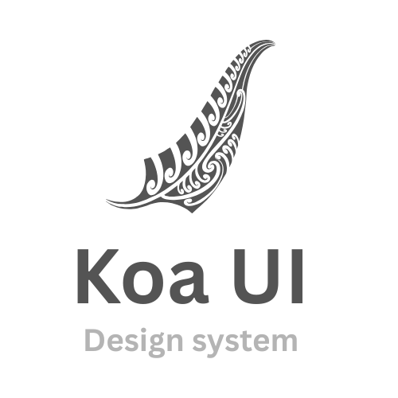

  

  

    
    
  

  <h1>Hi there! </h1>
  

    I'm <strong>Liantsoa</strong> — a Frontend Engineer based in Germany, previously in New Zealand for 5 years. 
    I’m passionate about clean code, continuous learning, and building intuitive, performant web applications.
  

<h2>🔧 Tech Stack</h2>

<table>
  <tr>
    <td colspan="2">
      <h3>Frontend</h3>
       
    

</td>
  </tr>
  <tr>
    <td>
      <h3>Backend</h3>
       
      
      
    </td>
    <td>
      <h3>DevOps & Tools</h3>
      
    </td>
  </tr>
</table>

<h3>📚 Currently learning cloud engineering</h3>

  

<h3>Exploring these technologies out of curiosity</h3>

  

<h2>📌 Highlighted Projects</h2>

<h3>Web applications</h3>

<table>
  <tr>
    <td align="center">
      <a href="https://github.com/lrasata/lrasata-website">
        <strong>Personal Portfolio</strong> 
        
      </a>
    </td>
    <td align="center">
            <a href="https://github.com/lrasata/koa-ui">
        <strong>Koa UI -  Design System</strong> 
        
      </a>
    </td>
    <td align="center">
      <a href="https://github.com/lrasata/todo-list-app">
        <strong>My TODO List</strong> 
        
      </a>
    </td>
    <td align="center">
      <a href="https://github.com/lrasata/themeal-recipe-db-app">
        <strong>The Meal recipe DB</strong> 
        
      </a>
    </td>
  </tr>
  <tr>
    <td align="center">
      <a href="https://github.com/lrasata/pokedex/tree/develop">
        <strong>Pokedex</strong> 
        
      </a>
    </td>
    <td align="center">
            <a href="https://github.com/lrasata/question-workflow-frontend-app">
        <strong>Question workflow App</strong> 
        
      </a>
        </td>
    <td align="center">
          <strong>Coming Soon!</strong>
        </td>
    <td align="center">
          <strong>Coming Soon!</strong>
        </td>
  </tr>
</table>

<h3>Infrastructures</h3>

<table>
  <tr>
    <td align="center">
      <a href="https://github.com/lrasata/infra-trip-planner-webapp">
        <strong>Trip Planner Infrastructure</strong> 
        
      </a>
    </td>
    <td align="center">
      <a href="https://github.com/lrasata/infra-lrasata-website">
        <strong>Portfolio website Infrastructure</strong> 
        
      </a>
    </td>
    <td align="center">
          <strong>Coming Soon!</strong>
        </td>
    <td align="center">
          <strong>Coming Soon!</strong>
        </td>
  </tr>

</table>
