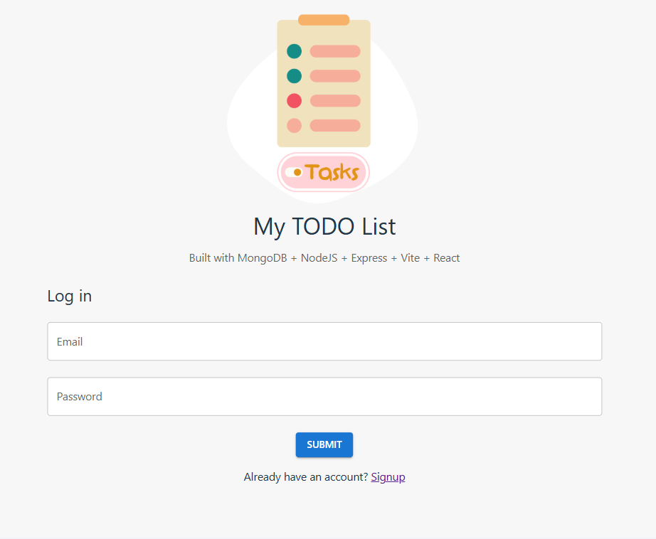

  <h1>Hi there! </h1>
  

    I'm <strong>Liantsoa</strong> — an aspiring Cloud Engineer (AWS Certified) with a full-stack background.
    Currently exploring, learning, and <strong>bringing ideas to life in the cloud</strong> ☁️
  

  

    
    
  

## 🔧 Tech Stack

### ☁️ Cloud & DevOps

---

### ⚙️ Backend

---

### 🎨 Frontend

---

### 📚 Currently Learning

<h2>📌 Highlighted Projects</h2>

<h3>Infrastructures</h3>

<table>
  <tr>
    <td align="center">
      <a href="https://github.com/lrasata/infra-lrasata-website">
        <strong>Portfolio website</strong> 
        
      </a>
    </td>
    <td align="center">
      <a href="https://github.com/lrasata/infra-trip-planner-webapp">
        <strong>Full Stack 3-Tier web app on AWS</strong> 
        
      </a>
    </td>
    <td align="center">
      <a href="https://github.com/lrasata/infra-image-uploader">
        <strong>File uploader</strong> 
        
      </a>
        </td>

  </tr>
<tr>
    <td align="center">
      <a href="https://github.com/lrasata/infra-s3-image-moderator">
        <strong>Image moderator</strong> 
        
      </a>
        </td>
    <td align="center">
          <strong>Coming Soon!</strong>
        </td>
    <td align="center">
          <strong>Coming Soon!</strong>
        </td>
</tr>

</table>

<h3>Web applications</h3>

<table>
  <tr>
    <td align="center">
      <a href="https://github.com/lrasata/lrasata-website">
        <strong>Personal Portfolio</strong> 
        
      </a>
    </td>
    <td align="center">
                    <a href="https://github.com/lrasata/koa-ui">
        <strong>Koa UI -  Design System</strong> 
        
      </a>
    </td>
    <td align="center">
            <a href="https://github.com/lrasata/trip-planner-web-app">
        <strong>Trip planner web app</strong> 
        
      </a>
    </td>
    <td align="center">
      <a href="https://github.com/lrasata/todo-list-app">
        <strong>My TODO List</strong> 
        
      </a>
    </td>
  </tr>
  <tr>
    <td align="center">
      <a href="https://github.com/lrasata/themeal-recipe-db-app">
        <strong>The Meal recipe DB</strong> 
        
      </a>
    </td>
    <td align="center">
      <a href="https://github.com/lrasata/pokedex/tree/develop">
        <strong>Pokedex</strong> 
        
      </a>
        </td>
    <td align="center">
        <a href="https://github.com/lrasata/question-workflow-frontend-app">
        <strong>Question workflow App</strong> 
        
      </a>
        </td>
    <td align="center">
          <strong>Coming Soon!</strong>
        </td>
  </tr>
</table>

